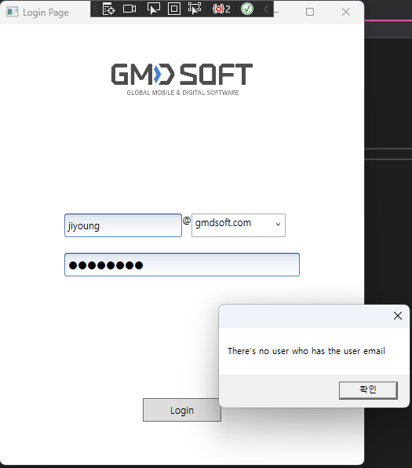
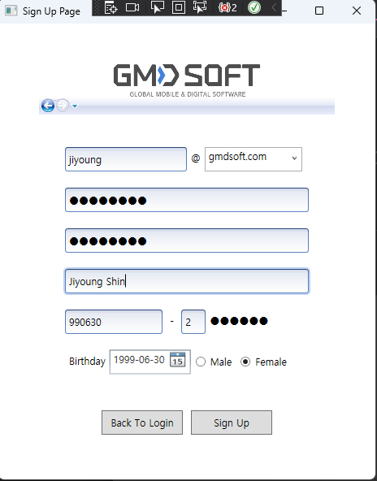
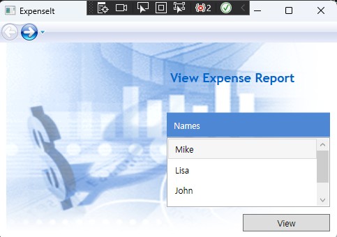
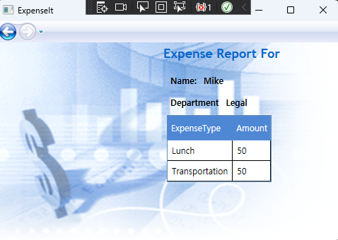

# WPF Study (4.25~)
## WPF HW1
### I've Learned..
- Understanding the meaning of UI/UX
- Making a simple sign up page (similar with Naver sign up)

### My Question
- Q) How can I change the window title when the pages have their own titles?
- A) In that case, we have to change one by one by using page_loaded event handler.

### Review
- In a view of UX, it would be better to use ComboBox to represent values more than 2.
- Every window should have minWidth and minHeight to prevent from ruining the shapes when users changes the window size.
- In a view of UX, we have to think of label text. Label or NullText, which one is better to show the content to be typed in?

### Running Process
  
  

## WPF HW2
### I've Learned..
- Grid, ListBox, StackPanel
- Label, Button
- DataGrid
- Event Handler (Click)
- Style, Template, Image  

[MicroSoft My First WPF Application](https://learn.microsoft.com/ko-kr/dotnet/desktop/wpf/getting-started/walkthrough-my-first-wpf-desktop-application)   

### Question
- Q) Where is the default directory of Image source? When I load "watermark.png", where does the program try to find the image from?
- A) If I set the build mode of image to "Resource", compiler automatically merges the image to .dll file as a resource.
- Q) What is Grid.ColumnSpan?
- A) ColumnSpan and RowSpan value are used to take up more than 1 cell.
For example, if I want to dispose textblock in the grid (1,1) and (2,1), it can be Grid.Row=1, Grid.Column=1, and Grid.Column=2 because it takes up the 2 columns from column 1.
- Q) What is difference between XPath and Path when binding?
- A) Normally binding something is done by Path, and XPath is for XML data binding. Also, there is some different syntax for querying.

### Running Process
  
  

