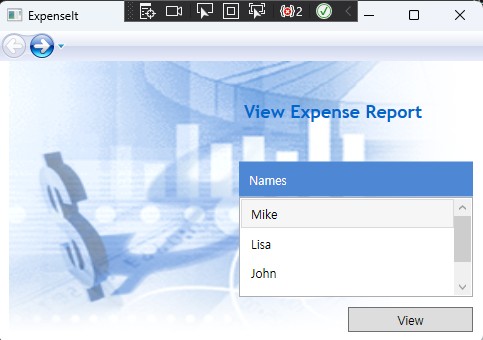
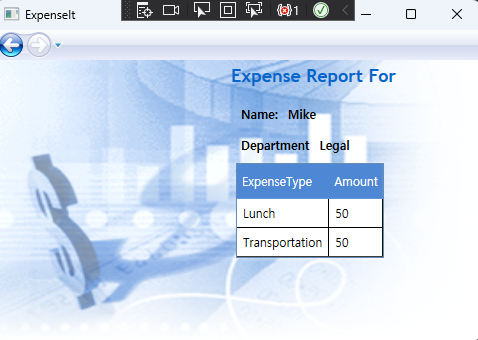

# WPF HW2
## Have Learned..
- Grid, ListBox, StackPanel
- Label, Button
- DataGrid
- Event Handler (Click)
- Style, Template, Image  

  
  
[MicroSoft My First WPF Application](https://learn.microsoft.com/ko-kr/dotnet/desktop/wpf/getting-started/walkthrough-my-first-wpf-desktop-application)

