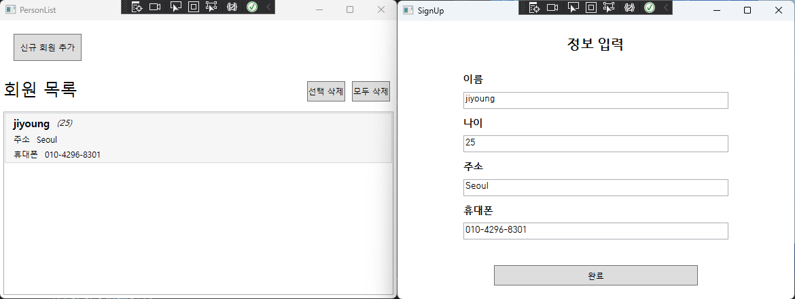

# WPF Study (4.25~)

# Table of contents
1. [WPF HW1 : Making a sign up and a login page](#hw1)
2. [WPF HW2 : Expense Report Example](#hw2)
3. [WPF HW3 : Animated Button Example](#hw3)
4. [WPF HW4 : Making a Person Infomation List Page](#hw4)

*****

## WPF HW1 : Making a sign up and a login page 
### I've Learned..
- Understanding the meaning of UI/UX
- Making a simple sign up page (similar with Naver sign up)

### My Question
- Q) How can I change the window title when the pages have their own titles?
- A) In that case, we have to change one by one by using page_loaded event handler.

### Review
- In a view of UX, it would be better to use ComboBox to represent values more than 2.
- Every window should have minWidth and minHeight to prevent from ruining the shapes when users changes the window size.
- In a view of UX, we have to think of label text. Label or NullText, which one is better to show the content to be typed in?

### Screenshot of a running process

  

*****

## WPF HW2 : Expense Report Example 
### I've Learned..
- Grid, ListBox, StackPanel
- Label, Button
- DataGrid
- Event Handler (Click)
- Style, Template, Image  

- `Link` : [MicroSoft My First WPF Application](https://learn.microsoft.com/ko-kr/dotnet/desktop/wpf/getting-started/walkthrough-my-first-wpf-desktop-application)   

### Question
- Q) Where is the default directory of Image source? When I load "watermark.png", where does the program try to find the image from?
- A) If I set the build mode of image to "Resource", compiler automatically merges the image to .dll file as a resource.  
  
- Q) What is Grid.ColumnSpan?
- A) ColumnSpan and RowSpan value are used to take up more than 1 cell.
For example, if I want to dispose textblock in the grid (1,1) and (2,1), it can be Grid.Row=1, Grid.Column=1, and Grid.Column=2 because it takes up the 2 columns from column 1.
  
- Q) What is difference between XPath and Path when binding?
- A) Normally binding something is done by Path, and XPath is for XML data binding. Also, there is some different syntax for querying.

### Screenshot of a running process

*****

### WPF HW3 : Animated Button Example 
### I've Learned..
- Style
- Animation
- Event Trigger

### Question
- Q) What is different between `<Style TartgetType="Button">` and `<Style TargetType="{x:Type Button}">`?
- A) These are the same but we usually prefer the second one.

- Q) Why do we use `Grid` inside of `ControlTemplate`? I just guess `ControlTemplate` should have only one child.
- A) Correct. Link : [Link](https://learn.microsoft.com/ko-kr/dotnet/desktop/wpf/controls/how-to-create-apply-template?view=netdesktop-7.0)
  
- Q) What is different between `Trigger` and `EventTrigger`?
- A) We should know about 4 types of Trigger : Property Trigger, Event Trigger, Data Trigger, Multi Trigger. Link : [Link](https://just-my-blog.tistory.com/48)

### Screenshot of a running process

*****

## WPF HW4 : Making a Person Infomation List Page 
### I've Learned..
- using MVVM Pattern
- Modal

### Question
- Q) Is it a good pattern that model depends on a viewModel? If not, should a viewModel have models as a member instance?
- A) ?
   
- Q) Do I only have to make DelegateCommand to allocate any method to ICommand? Or is there any solution or library to use something like DelegateCommand?
- A) ?

- Q) How can modal send any data to their parent windows?
- A) ?

- Q) Can I use string format in view (xaml) or is it better to do this in viewModel when showing data?
- A) ?

### Screenshot of a running process

*****
